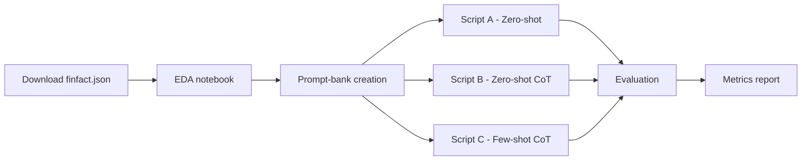

# Financial Misinformation Detection — Single‑LLM Baseline Study

**Prepared by:**  
Expert ML/DS Consultant (LLM specialisation, ex‑Meta, >$100 M projects)

---

## 1  Objectives
* Build **three fully independent OpenAI mini‑model classifiers**:
  1. **Zero‑shot Standard Prompt** – task instruction + claim only  
  2. **Zero‑shot Chain‑of‑Thought (CoT)** – add "Let’s think step‑by‑step" reasoning (Wei et al., 2022)  
  3. **Few‑shot CoT** – eight in‑context examples mined from *finfact.json*
* Output binary **True / False** for each claim, plus optional rationale for CoT runs.
* Evaluate each model **separately** with **accuracy, precision, recall, F1‑real, F1‑fake**.
* **No fine‑tuning, no cross‑model interaction, no external tools**.
* Keep **Exploratory Data Analysis (EDA)** in a **stand‑alone Google Colab notebook**; LLM scripts run offline in repo or separate Colab.

---

## 2  Scope & Constraints
| Item | Decision |
|------|----------|
| **Dataset** | `finfact.json` (≈ 3.6 k labelled claims) |
| **Models** | Prefer `o4‑mini`; fallback `gpt‑4.1` |
| **Framework** | Python 3.11 + OpenAI Python SDK ≥ 1.3.8 |
| **Compute** | Colab FREE tier (EDA) / local or Colab (inference) |
| **Fine‑tuning** | **None** – prompt engineering only |
| **Internet access** | Disabled (closed‑book evaluation) |

---

## 3  Repository Layout
```
├── data/
│   └── finfact.json
├── notebooks/
│   └── eda.ipynb              # self‑contained EDA
├── prompts/
│   ├── standard.txt           # template 1
│   ├── cot_zero.txt           # template 2
│   └── cot_fewshot.txt        # template 3 (8 examples)
├── scripts/
│   ├── zeroshot_standard.py   # Model A
│   ├── zeroshot_cot.py        # Model B
│   ├── fewshot_cot.py         # Model C
│   └── evaluate.py            # Metrics pipeline
├── reports/
│   └── metrics.md
├── tests/
│   └── test_pipeline.py
├── PLANNING.md
└── TASK.md
```

---

## 4  Workflow Overview


---

## 5  Data Pipeline
1. **Fetch** JSON from GitHub raw (≈ 7 MB).  
2. **Load** with `pandas.read_json`.  
3. **Shuffle + stratified split** (70 / 15 / 15 train/val/test) using `sklearn`.  
4. Save splits to CSV for deterministic reuse.

---

## 6  Prompt Engineering
### 6.1  Token Budget  
Keep total (prompt + claim + reasoning + answer) **≤ 800 tokens**.

### 6.2  Few‑shot Example Selection  
* 8 examples → 4 *True*, 4 *False*  
* Diverse `issues` tags (`stock`, `macro`, `crypto`, `regulation`)  
* Medium‑length claims (15–25 tokens)

### 6.3  Template Skeletons
* **Standard**  
  ```
  System: You are a financial fact‑checking assistant.  
  User: <claim text>  
  Assistant: <True/False>  
  ```
* **CoT zero‑shot** – prepend *“Let’s think step‑by‑step.”* then answer.  
* **CoT few‑shot** – 8 Q/A reasoning blocks, then new claim.

---

## 7  Evaluation Metrics
| Metric | Formula | Note |
|--------|---------|------|
| Accuracy | (TP + TN) / All | Overall |
| Precision | TP / (TP + FP) | for *True* |
| Recall | TP / (TP + FN) | for *True* |
| F1‑real | 2 · Prec · Rec / (Prec + Rec) | label *True* |
| F1‑fake | F1 for label *False* | |

Use `sklearn.metrics` ([`classification_report`](https://scikit-learn.org/stable/modules/generated/sklearn.metrics.classification_report.html)).

---


## 8  Risks & Mitigations
| Risk | Mitigation |
|------|------------|
| *o4‑mini* unavailable | Env flag fallback to *gpt-4.1* |
| Class imbalance | Stratified split, report per‑class F1 |
| API cost spikes | Cache responses, low‑temp sampling |

---

## 9  References
* Wei et al. 2022 — Chain‑of‑Thought Prompting  
* Aman Rangapur et al. 2023 — Fin‑Fact Dataset
